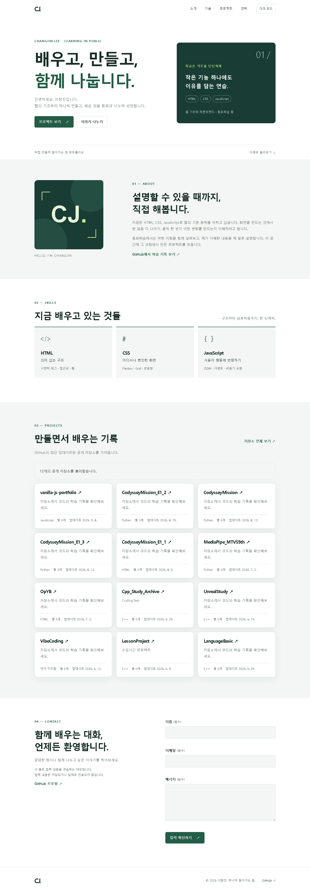
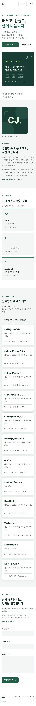
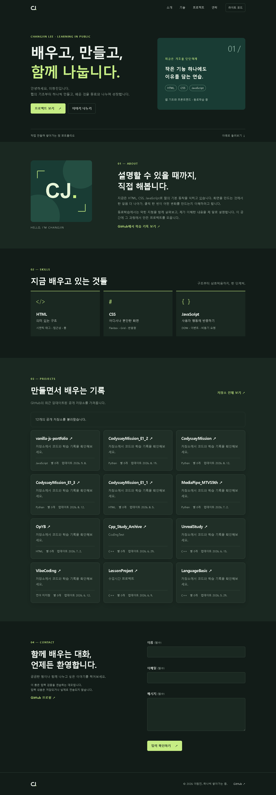

# 나를 소개하는 웹페이지 처음부터 만들기

**HTML · CSS · JavaScript로 직접 만드는 이창진의 반응형 포트폴리오**

> 버튼을 누르면 왜 화면이 바뀔까? **이벤트 → 상태 변경 → 화면 업데이트**를 코드로 확인하고 동료에게 설명하는 웹 기초 학습 프로젝트입니다.

**[웹사이트 열기](https://dlckdwls76.github.io/vanilla-js-portfolio/) · [동료학습 가이드](docs/LEARNING_GUIDE.md) · [검증 체크리스트](docs/TEST_CHECKLIST.md)**

| 항목 | 내용 |
| --- | --- |
| 분야 / 과정 | AI·SW 기초 / 웹 기초와 프론트엔드 |
| 학습시간 | 과제 기준 80시간 — 실제 완료 시간을 의미하지 않음 |
| 학습 방식 | 직접 실행 → 코드 읽기 → 수정 → 서로 설명 |
| 기술 | 순수 HTML5, CSS3, JavaScript ES6+ |
| 라이브러리 | 없음. React, Vue, jQuery, Bootstrap, Tailwind 미사용 |
| 배포 | GitHub Pages |

## 1. 처음 보는 동료에게

자기소개, 배우는 기술, GitHub 프로젝트, 문의 폼으로 구성된 웹사이트입니다. HTML이 구조를 만들고, CSS가 화면을 꾸미고, JavaScript가 사용자 행동에 반응합니다.

1. 사이트에서 다크 모드를 켜고 새로고침합니다. 선택이 유지되는지 확인합니다.
2. 창을 좁혀 햄버거 메뉴를 열고 프로젝트 섹션으로 이동합니다.
3. 문의 폼을 비워서 확인한 뒤 값을 입력합니다. 오류 문구의 변화를 봅니다.
4. [`js/main.js`](js/main.js)의 `state`, `renderTheme()`, `toggleTheme()`를 순서대로 읽습니다.
5. “버튼 → 상태 → 화면” 흐름을 동료에게 자기 말로 설명합니다.

문의 폼은 **입력 검증 연습용 데모**입니다. 입력 내용은 실제로 전송하거나 저장하지 않습니다. 검증 완료 메시지는 이메일 전송 성공을 뜻하지 않습니다.

## 2. 실행 방법

```bash
git clone https://github.com/dlckdwls76/vanilla-js-portfolio.git
cd vanilla-js-portfolio
code .
```

1. VS Code 확장에서 **Live Server (Ritwick Dey)**를 설치합니다. 저장소에도 추천 확장을 등록했습니다.
2. `index.html`에서 마우스 오른쪽 버튼 → **Open with Live Server**를 선택합니다.
3. 파일을 저장하면서 브라우저의 변경된 화면을 확인합니다.

패키지 설치나 빌드 명령은 없습니다. 파일 더블클릭보다 로컬 웹 서버로 실행하는 것을 권장합니다.

Python이 있다면 `python -m http.server 5500`을 실행하고 `http://localhost:5500`을 열어도 됩니다. 이 방법은 자동 새로고침을 제공하지 않습니다.

## 3. 폴더와 코드 읽는 순서

```text
vanilla-js-portfolio/
├── index.html                 # 시맨틱 구조, 섹션, 폼, 접근성
├── css/style.css              # 테마 변수 → 공통 → 섹션 → 반응형
├── js/main.js                 # 상태, 렌더링, 이벤트, API, 폼 검증
├── images/profile.svg         # 직접 만든 CJ 이니셜 프로필
├── docs/
│   ├── LEARNING_GUIDE.md       # 개념, 발표 순서, 연습 문제
│   ├── TEST_CHECKLIST.md       # 기능 검증과 확인 기록
│   └── screenshots/           # 데스크톱 / 모바일 / 다크 모드
├── .vscode/extensions.json    # Live Server 추천
├── .gitattributes             # 텍스트 줄바꿈 통일
├── .gitignore                 # 비밀값·임시 결과 제외
├── .nojekyll                  # 정적 파일을 그대로 제공
└── README.md
```

**추천 순서: `index.html` → `css/style.css` → `js/main.js`**

전체 흐름을 한눈에 따라갈 수 있도록 JavaScript는 한 파일에 모았습니다. 내부는 **설정 → 상태 → DOM 선택 → 기능별 함수 → 이벤트 연결 → 초기 실행** 순서입니다. 기능이 커지면 모듈 분리를 다음 연습으로 진행할 수 있습니다.

## 4. 구현 기능과 학습 포인트

| 기능 | 코드에서 찾을 곳 | 설명할 핵심 |
| --- | --- | --- |
| 6개 필수 섹션 | `index.html` | Hero, About, Skills, Projects, Contact, Footer |
| 메뉴 가로 배치 | `.navigation` | Flexbox로 한 방향 정렬 |
| 프로젝트 카드 | `.projects-grid` | Grid의 `auto-fit` + `minmax`로 열 수 조절 |
| 햄버거 메뉴 | `renderMenu()` | 상태와 `active`, `aria-expanded` 동기화 |
| 부드러운 이동 | `html`의 `scroll-behavior` | 앵커 링크의 기본 동작 활용 |
| 탐색 배경 / 맨 위 버튼 | `renderScroll()` | 스크롤 위치에 따라 표시 변경 |
| 다크 모드 유지 | `readTheme()`, `toggleTheme()` | 상태 변경 → 렌더링 → localStorage 저장 |
| 등장 애니메이션 | `initReveal()` | Intersection Observer로 보이는 요소 감지 |
| GitHub 저장소 | `loadProjects()`, `renderProjects()` | 요청과 화면 갱신 분리 |
| 폼 검증 | `validateField()`, `renderForm()` | 검증과 오류 표시 분리 |

### 기준값

| 항목 | 값 | 변경 위치 |
| --- | --- | --- |
| 태블릿 / 데스크톱 | `768px` / `1024px` | CSS 미디어 쿼리 |
| 탐색 배경 변경 | 스크롤 `60px 이상` | `SETTINGS.headerScrollThreshold` |
| 맨 위 버튼 표시 | 스크롤 `300px 이상` | `SETTINGS.topButtonScrollThreshold` |
| 등장 감지 비율 | `0.2` | `SETTINGS.revealThreshold` |
| API 대기 제한 | `10초` | `SETTINGS.requestTimeoutMs` |
| 테마 저장 키 | `portfolio-theme` | `SETTINGS.themeStorageKey` |
| 저장소 수 | 최근 업데이트 순 최대 `12개` | `loadProjects()` 요청 URL |

메뉴의 768px 기준은 JavaScript `matchMedia`에도 있습니다. 기준을 바꾸면 CSS와 JavaScript를 함께 수정하세요.

## 5. 핵심: 이벤트 → 상태 → 렌더링

```text
테마 클릭 → state.theme 변경 → renderTheme() → 스타일과 버튼 문구 변경
API 요청  → loading / success / empty / error → renderProjects() → 목록·안내 변경
폼 입력   → errors / touched 변경 → renderForm() → 오류 표시·숨김
메뉴 클릭 → state.menuOpen 변경 → renderMenu() → 메뉴와 접근성 상태 변경
```

`state.theme`은 **기억하는 값**, `renderTheme()`은 **값을 화면에 옮기는 함수**, `localStorage`는 **새로고침 후에도 선택을 기억하는 저장소**입니다. 역할을 구분해서 설명하는 것이 목표입니다.

React를 배우기 위한 준비 단계입니다. 현재는 상태를 바꾼 뒤 개발자가 `render...()`를 직접 호출한다는 점을 기억하세요.

## 6. GitHub API 동작

```text
GET https://api.github.com/users/dlckdwls76/repos?sort=updated&direction=desc&per_page=12
```

최근 업데이트된 공개 저장소를 최대 12개 표시합니다. 다음 페이지를 순회하는 전체 목록 기능은 없으며, 전체 저장소는 섹션의 GitHub 링크에서 확인합니다.

| 상태 | 조건 | 화면 |
| --- | --- | --- |
| loading | 요청 시작 | 불러오는 중 안내 |
| success | 저장소 1개 이상 | `map()`으로 만든 카드 |
| empty | 빈 배열 응답 | 표시할 프로젝트가 없다는 안내 |
| error | HTTP·통신 오류·시간 초과 | 오류 안내 + 다시 시도 |

`fetch()`는 HTTP 403·404·500을 자동으로 예외 처리하지 않습니다. `response.ok`를 검사한 뒤 `throw`하고 `catch`에서 오류 상태로 바꿉니다. 403·429에서는 요청 제한 안내를 표시합니다. 403은 권한 문제 등 다른 원인으로도 발생할 수 있습니다.

인증 없는 GitHub REST API 요청은 기본적으로 **IP 기준 시간당 60회**로 제한됩니다. 같은 네트워크의 동료들과 호출량을 공유할 수 있으므로 반복 새로고침을 피하세요. 초기 진입과 오류 후 재시도 때만 요청하고 로딩 중 중복 요청을 막습니다. API 키나 토큰은 넣지 않습니다.

외부 데이터로 HTML을 생성하므로 이름·설명·언어를 `escapeHTML()`로 처리합니다. 링크는 고정된 GitHub 주소와 인코딩한 저장소 이름으로 만듭니다.

## 7. 접근성과 제약사항

- 의미에 맞는 `header`, `nav`, `main`, `section`, `article`, `footer` 사용
- 이미지 `alt`, 폼 `label`의 `for`와 `id` 연결
- 본문 바로가기, 키보드 초점 표시, 메뉴 Escape 닫기
- 필드별 오류와 `aria-describedby` 연결, 첫 오류로 초점 이동
- `role="status"` 안내와 메뉴·테마 버튼 접근성 상태 동기화
- 동작 줄이기 설정에서 스크롤·등장 애니메이션 축소
- `const`·`let`, `defer`, `addEventListener` 사용; `var`, HTML 이벤트 속성, 인라인 `style` 미사용

기본 테마는 라이트입니다. 저장이 차단되어도 현재 탭에서 테마를 바꿀 수 있지만 새로고침 후 저장값 유지가 제한됩니다.

선택 과제인 언어 필터, 타이핑 효과, 실제 이메일 전송, 시스템 테마 자동 감지는 포함하지 않았습니다. 필수 흐름을 먼저 설명한 뒤 확장할 연습으로 남겼습니다.

## 8. 화면 미리보기

실제 GitHub API 응답을 사용한 로컬 실행 화면입니다. 같은 응답을 재사용해 불필요한 호출을 줄였습니다. 저장소 내용은 이후 달라질 수 있습니다.

### 데스크톱 · 1440px



<details>
<summary>모바일 · 390px / 다크 모드 · 1440px 보기</summary>





</details>

## 9. GitHub Pages 배포

**[배포된 웹사이트](https://dlckdwls76.github.io/vanilla-js-portfolio/)**

저장소 **Settings → Pages → Build and deployment** 설정:

- Source: `Deploy from a branch`
- Branch: `main`
- Folder: `/(root)`

`main`에 변경사항을 푸시하면 Pages가 갱신됩니다. 반영에는 시간이 걸릴 수 있으며 Actions에서 배포 상태를 확인합니다. 실패하면 Pages 설정과 파일 경로의 대소문자를 먼저 확인하세요.

CSS·JavaScript·이미지는 상대 경로를 사용합니다. `/css/style.css`처럼 시작하면 프로젝트 경로인 `/vanilla-js-portfolio/`를 건너뛰므로 `css/style.css`처럼 작성합니다.

## 10. 커밋도 학습 기록으로

메시지는 **`유형: 무엇을 바꿨는지`**로 통일합니다. 목적이 다른 변경은 나누어 기록합니다.

| 유형 | 사용 시점 | 작성 예시 |
| --- | --- | --- |
| `feat` | 새 기능 | `feat: GitHub 저장소 카드 렌더링 구현` |
| `fix` | 오류 수정 | `fix: 메뉴의 키보드 초점 처리 수정` |
| `docs` | 설명·기록 | `docs: 동료학습 가이드와 검증 기록 추가` |
| `style` | 표시·형식 수정 | `style: 모바일 메뉴의 햄버거 아이콘 표시` |
| `refactor` | 동작을 유지한 구조 개선 | `refactor: 폼 검증과 렌더링 분리` |

표는 메시지 예시입니다. 실제 작업은 [커밋 이력](https://github.com/dlckdwls76/vanilla-js-portfolio/commits/main/)에서 확인하세요. 변경 후 `git diff`를 읽고 [체크리스트](docs/TEST_CHECKLIST.md)로 영향을 받은 기능을 확인한 뒤 커밋합니다.

## 11. 학습 완료 전 스스로 답하기

1. 왜 전체 화면을 `div`로만 만들지 않았나요?
2. 메뉴에는 Flexbox, 프로젝트에는 Grid를 선택한 이유는 무엇인가요?
3. `state.theme`을 바꾸기만 하면 화면도 자동으로 바뀌나요?
4. `response.ok`를 확인하지 않으면 어떤 문제가 생기나요?
5. `map()` 결과에 `.join("")`을 붙이는 이유는 무엇인가요?
6. 빈 목록과 오류는 왜 다른 상태인가요?
7. 새로고침하면 사라지는 상태와 유지되는 상태는 무엇인가요?

해설과 실습은 [동료학습 가이드](docs/LEARNING_GUIDE.md)에서 이어집니다.

## 참고 문서

- [MDN: 시맨틱 요소](https://developer.mozilla.org/ko/docs/Glossary/Semantics)
- [MDN: Fetch API](https://developer.mozilla.org/ko/docs/Web/API/Fetch_API/Using_Fetch)
- [GitHub: 사용자 저장소 조회](https://docs.github.com/en/rest/repos/repos#list-repositories-for-a-user)
- [GitHub: API 요청 제한](https://docs.github.com/en/rest/using-the-rest-api/rate-limits-for-the-rest-api)
- [GitHub: Pages 배포 소스 설정](https://docs.github.com/en/pages/getting-started-with-github-pages/configuring-a-publishing-source-for-your-github-pages-site)
